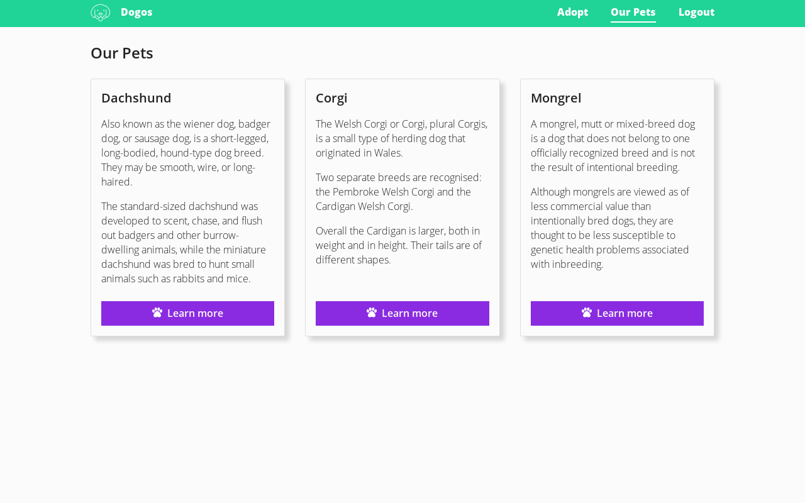

# Magnet.cl - Frontend test

This technical test requires you to implement a HTML and CSS page based on a reference design.

## Description

### Project structure

The project is a static web page with a single HTML file: `index.html`.

Some additional resources are required by this page:
* style.css: A file where you should implement the styles for the site.
* site.js: A helper you cannot edit, that emulates dynamic content for the page.
* img: A folder with all the images required by the site.
* Open Sans: This font is downloaded from Google Fonts and it's already required in the HTML and CSS.

### Environment

Your solution will be tested and ranked by an automated testing tool.

A fairly modern browser version will be used for this.
You can assume your solution is not going to be tested against a browser version older than 6 months.

Only the `index.html` and the `style.css` files will be read from your repository.
**Do not** edit the images, the javascript or the repository structure.

You cannot add additional dependencies.
If you use a CSS preprocessor (not required), make sure to compile the output without minifying to style.css. Our test suite will not run any build steps.

### General goals

Your goal is to implement the HTML and CSS required for the site to look exactly like the reference design.

The design is responsive, with a 3-column layout in desktop and a single-column for mobile.
There is a single breakpoint to change from 1 to 3 columns when the viewport is `768px` or wider. No additional breakpoints are required.

You can see the full size reference renders with different pixel densities at different resolutions here:
* 1440 x 900: [@1x normal](readme-files/1440-900-1x.png) and [@2x](readme-files/1440-900-2x.png)
* 1280 x 800: [@1x normal](readme-files/1280-800-1x.png) and [@2x](readme-files/1280-800-2x.png)
* 480 x 960: [@1x normal](readme-files/480-960-1x.png) and [@2x](readme-files/480-960-2x.png)

The behavior of each element at different resolutions can be deduced from these images.

You **do not** need to support screens narrower than `480px`, **but** your solution has to work on any screen wider than that, even if they are not listed above.

To determine the size and position of every element, you can use [this image](readme-files/helper-1x.png) as a helper, where the background of the elements with text was replaced by a solid color.

In the `index.html` file, you can find some *template tags* (variables between `{ }`). They are used to provide the content of your page.
**Do not** delete them.

The only available tags are: `{navlinks}`, `{title}`, `{content1}`, `{content2}` and `{content3}`.

#### Delivery method

You will have full write access to your own fork of this project at
http://interviews.magnet.cl/{your-user-name}/magnet-frontend-test
Send us an email to interviews@magnet.cl when you push your
last commit to the `master` branch and your answer is ready for review.

Pull/Merge requests are not allowed on this project to prevent your answers
from being visible by other candidates.

## Aspects to be evaluated

* Accurate layout implementation.
* Accurate use of colors.
* Coding style.
* Repository use.
* Compliance of these instructions.

## Aspects to be ignored

* Deployment to any server.
* If you are faster or slower than other candidates (as long as you are within the deadline).
* Animations, transitions, or any visual effects that are not apparent from the reference design.
